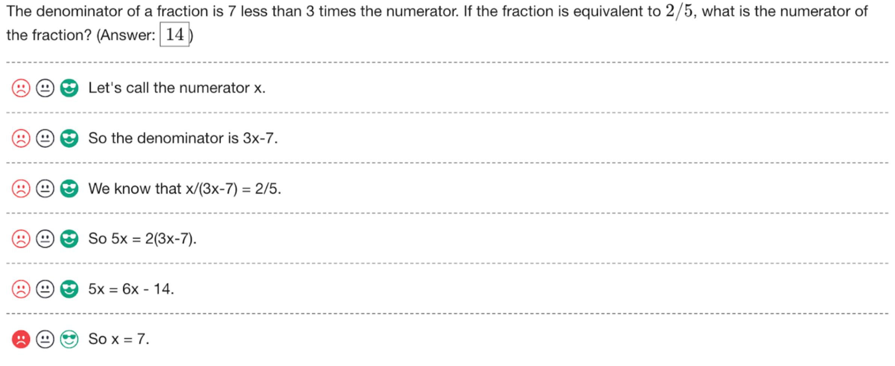

# PRM800K: A Process Supervision Dataset

#### [[Blog Post]](https://openai.com/research/improving-mathematical-reasoning-with-process-supervision) [[Paper]](https://arxiv.org/abs/2305.20050)

This repository accompanies the paper [Let's Verify Step by Step](https://arxiv.org/abs/2305.20050) and presents the PRM800K dataset introduced there. PRM800K is a process supervision dataset containing 800,000 step-level correctness labels for model-generated solutions to problems from the [MATH](https://github.com/hendrycks/math) dataset. More information on PRM800K and the project can be found in the paper.

We are releasing the raw labels as well as the instructions we gave labelers during phase 1 and phase 2 of the project. Example labels can be seen in the image below.

<p align="center">
    
</p>


## Data

The `data/` folder contains our labels formatted as newline-delimited lists of `json` data. The data has been uploaded with [Git LFS](https://git-lfs.com/), which you'll need to install in order to properly clone the repository.

Each line represents 1 full solution sample and can contain many step-level labels. Here is one annotated line:


```javascript
{
  // UUID representing a particular labeler.
  "labeler": "340d89bc-f5b7-45e9-b272-909ba68ee363",

  // The timestamp this trajectory was submitted.
  "timestamp": "2023-01-22T04:34:27.052924",

  // In phase 2, we split our data collection into generations, using our best
  // PRM so far to pick which solutions to score in the next generation.
  // In phase 1, this value should always be null.
  "generation": 9,

  // In each generation, we reserve some solutions for quality control. We serve
  // these solutions to every labeler, and check that they agree with our
  // gold labels.
  "is_quality_control_question": false,

  // generation -1 was reserved for a set of 30 questions we served every
  // labeler in order to screen for base task performance.
  "is_initial_screening_question": false,

  // Metadata about the question this solution is a response to.
  "question": {
    // Text of the MATH problem being solved.
    "problem": "What is the greatest common factor of $20 !$ and $200,\\!000$?  (Reminder: If $n$ is a positive integer, then $n!$ stands for the product $1\\cdot 2\\cdot 3\\cdot \\cdots \\cdot (n-1)\\cdot n$.)",
    // Ground truth solution from the MATH dataset.
    "ground_truth_solution": "The prime factorization of $200,000$ is $2^6 \\cdot 5^5$. Then count the number of factors of $2$ and $5$ in $20!$. Since there are $10$ even numbers, there are more than $6$ factors of $2$. There are $4$ factors of $5$. So the greatest common factor is $2^6 \\cdot 5^4=\\boxed{40,\\!000}$.",
    // Ground truth answer.
    "ground_truth_answer": "40,\\!000",

    // The full steps of the model-generated solution. This is only set for
    // phase 2 where we pre-generated all solutions that we labeled.
    "pre_generated_steps": [
      "I want to find the largest positive integer that divides both $20 !$ and $200,\\!000$ evenly.",
      "One way to do this is to factor both numbers into prime factors and look for the common ones.",
      "I know that $200,\\!000 = 2^5\\cdot 10^4 = 2^9\\cdot 5^4$.",
      "To find the prime factorization of $20 !$, I can use the fact that it is the product of all the positive integers from $1$ to $20$.",
      "For each prime number $p$ between $1$ and $20$, I can count how many multiples of $p$ are in that range.",
      "For example, there are $10$ multiples of $2$ between $1$ and $20$, namely $2, 4, 6, \\dots, 20$.",
      "But there are also $5$ multiples of $4$, which is $2^2$, and $2$ multiples of $8$, which is $2^3$, and $1$ multiple of $16$, which is $2^4$.",
      "So, the total power of $2$ in $20 !$ is $10 + 5 + 2 + 1 = 18$.",
      "Similarly, there are $4$ multiples of $5$, namely $5, 10, 15, 20$, so the power of $5$ in $20 !$ is $4$.",
      "There are $6$ multiples of $3$, namely $3, 6, 9, \\dots, 18$, but there are also $2$ multiples of $9$, which is $3^2$, so the power of $3$ in $20 !$ is $6 + 2 = 8$.",
      "There are $2$ multiples of $7$, namely $7$ and $14$, so the power of $7$ in $20 !$ is $2$.",
      "There are $1$ multiple of each of the other prime numbers $11, 13, 17$, and $19$, so the powers of those primes in $20 !$ are $1$ each.",
      "Therefore, the prime factorization of $20 !$ is $2^{18}\\cdot 3^8\\cdot 5^4\\cdot 7^2\\cdot 11\\cdot 13\\cdot 17\\cdot 19$.",
      "To find the greatest common factor of $20 !$ and $200,\\!000$, I need to take the lowest power of each common prime factor.",
      "The only common prime factors are $2$ and $5$, and the lowest powers are $9$ and $4$, respectively.",
      "So, the greatest common factor is $2^9\\cdot 5^4 = 512\\cdot 625 = 320,\\!000$.\n\n# Answer\n\n320,000"
    ],
    // The answer given as the end of the pre-generated solution. We can see
    // this solution is incorrect.
    "pre_generated_answer": "320,000",
    // The score given by our PRM to this solution. This one isn't rated very
    // highly!
    "pre_generated_verifier_score": 0.010779580529581414
  },

  // The human data we collected for this solution, containing correctness
  // labels for each step of the solution.
  "label": {
    "steps": [
      // Each object here represents labels for one step of the solution.
      {
        // Each step will contain one or more completions. These are candidate
        // steps the model output at this step of the trajectory. In phase 1,
        // we frequently collect labels on alternative steps, while in phase 2
        // we only collect labels on alternative steps after the first mistake,
        // so most completions lists are singletons.
        "completions": [
          {
            // Text of the step.
            "text": "I want to find the largest positive integer that divides both $20 !$ and $200,\\!000$ evenly.",
            // The rating the labeler gave to this step. Can be -1, 0, or +1.
            // This is a 0 because it isn't incorrect, but it does not make
            // any progress.
            "rating": 0,
            // The labeler can flag steps that they don't know how to label.
            // This is rarely used.
            "flagged": null
          }
        ],
        // In phase 1, if all completions were rated -1, we allowed labelers to
        // write their own +1 step. This is null for all steps in phase 2.
        "human_completion": null,
        // The index of the completion "chosen" at this step, or null if the
        // human_completion was used. You can reconstruct the solution
        // trajectory like:
        // [
        //     step["human_completion"] if step["chosen_completion"] is None
        //     else step["completions"][step["chosen_completion"]]["text"]
        //     for step in labeled_solution["label"]["steps"]
        // ]
        "chosen_completion": 0
      },
      {
        "completions": [
          {
            "text": "One way to do this is to factor both numbers into prime factors and look for the common ones.",
            "rating": 0,
            "flagged": null
          }
        ],
        "human_completion": null,
        "chosen_completion": 0
      },
      {
        // Some steps contain multiple alternative completions, and each one
        // gets a rating.
        "completions": [
          {
            "text": "I know that $200,\\!000 = 2^5\\cdot 10^4 = 2^9\\cdot 5^4$.",
            "rating": -1,
            "flagged": null
          },
          {
            "text": "To factor $20 !$, I can use the fact that every factorial is a multiple of every number less than or equal to it.",
            "rating": 0,
            "flagged": false
          },
          {
            "text": "I can use a factor tree to find the prime factors of $200,\\!000$: $200,\\!000 = 2^5\\cdot 10^4 = 2^5\\cdot 2^4\\cdot 5^4 = 2^9\\cdot 5^4$.",
            "rating": -1,
            "flagged": false
          },
          {
            "text": "I can use a factor tree to find the prime factors of $200,\\!000$.",
            "rating": 0,
            "flagged": false
          },
          {
            "text": "To factor $20 !$, I can use the fact that any factorial is divisible by all the primes less than or equal to the input.",
            "rating": 0,
            "flagged": false
          }
        ],
        "human_completion": null,
        "chosen_completion": null
      }
    ],
    // Total time in milliseconds spent on labeling this solution.
    "total_time": 278270,
    // Final result of labeling this solution. Will be one of:
    //   - "found_error": In phase 2 we stop labeling a solution after the
    //                    first error is found.
    //   - "solution": We reached a step that concluded in the correct answer
    //                 to the problem.
    //   - "bad_problem": The labeler reported the problem as broken.
    //   - "give_up": The labeler was stuck (the problem was taking too long,
    //                or the instructions were unclear) and moved onto the
    //                next problem.
    "finish_reason": "found_error"
  }
}
```


## Instructions

The `instructions/` folder contains the instructions documents we gave to
labelers during each phase of the project.


## Answer Grading

The `grading/` folder contains the python grading logic we used for determining if a model-outputted answer correctly matched
the ground truth answer in Hendrycks' MATH dataset. We build off of Hendrycks' math normalization logic in `math_normalize.py`
and use sympy to check for equality of expressions in `grader.py`. We recommend using `grader.grade_answer(model_answer, gt_answer)`
where both answers are strings to determine if a solution is correct or not.

Answer grading is difficult in general. This grading logic is designed to be conservative and will sometimes reject correct
answers, though it does so less frequently than the normalization logic from MATH. Our logic might sometimes admit incorrect
answers, though we've put effort into minimizing this.


## MATH Splits

As explained in Let's Verify Step by Step, we use a nonstandard MATH train/test split.

> In order to avoid the risk of over-fitting on the 7,500 MATH training problems, we expanded the training set to include 4,500 MATH test split problems. We therefore evaluate our models only on the remaining 500 held-out problems. We selected these 500 test problems uniformly at random, and we believe they are representative of the test set as a whole.

The `math_splits/` folder contains our selected splits in the `train.jsonl` and `test.jsonl` files. You'll need [Git LFS](https://git-lfs.com/) to properly clone these files.


## Scored Samples

We release all large-scale model samples used to evaluate the large-scale ORM and PRM, corresponding to Figure 3 in the paper. Each test problem has to 1860 scored samples. Solutions that failed to reach an answer within 1024 tokens were discarded, resulting in less than 1860 samples on some problems. We account for this in the best-of-N evaluation logic. 

Evaluate the PRM:

```bash
python eval/eval.py --method prm
```

Evaluate the ORM:

```bash
python eval/eval.py --method orm
```


## Citation

Please use the below BibTeX entry to cite this dataset:

```
@article{lightman2023lets,
      title={Let's Verify Step by Step}, 
      author={Lightman, Hunter and Kosaraju, Vineet and Burda, Yura and Edwards, Harri and Baker, Bowen and Lee, Teddy and Leike, Jan and Schulman, John and Sutskever, Ilya and Cobbe, Karl},
      journal={arXiv preprint arXiv:2305.20050},
      year={2023}
}
```
